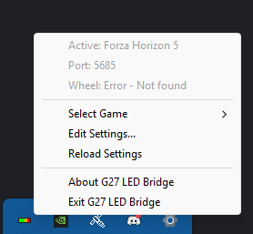

# G27 LED Bridge

Multi-game telemetry bridge that maps in-game RPM data to Logitech G27 Racing Wheel's RPM LED bar.

## Supported Games
- **DiRT Rally 2.0** - Original implementation
- **Forza Horizon 5** - New addition with full telemetry support

### LED Mapping

Active LED states are mapped linearly to RPM range `[(max - (max - idle) / 2)..max]`.

### Installation

Download the binary from [releases](https://github.com/rajiteh/G27-LED-Bridge/releases) page.

### Requirements

#### DiRT Rally 2.0 Setup
Requires DiRT Rally 2.0 telemetry option to be enabled.

Edit the file: `C:\Users\<UserName>\Documents\My Games\DiRT Rally 2.0\hardwaresettings\hardware_settings_config.xml`

Set the udp value to: `<udp enabled="true" extradata="3" ip="127.0.0.1" port="20777" delay="1" />`

#### Forza Horizon 5 Setup
Enable telemetry in game settings:
1. Go to **Settings > Gameplay & HUD**
2. Under **UDP RACE TELEMETRY**:
   - Set **Data Out** to **On**
   - Set **Data Out IP Address** to **127.0.0.1**
   - Set **Data Out IP Port** to **9999** (or your preferred port)
   - Set **Data Out Packet Format** to **Sled** (recommended for performance)

### Usage

Open the executable directly from windows.



Following flags can be set by invoking the executable from a command line or creating a windows shortcut with a modified target attribute.

```bash
# With initial game and port settings (saved for future runs)
g27-led-bridge.exe --game fh5 --port 5685

# Keep console open for debugging in tray mode
g27-led-bridge.exe --console

# Exit immediately if G27 wheel is not found (useful for scripts/automation)
g27-led-bridge.exe --require-wheel

# Continuous test pattern (press Ctrl+C to stop)
g27-led-bridge.exe test --continuous
```

**Available game aliases**:
- DiRT Rally 2.0: `dirt-rally-2`, `dr2`, `dirt`
- Forza Horizon 5: `forza-horizon-5`, `fh5`, `forza`

### Settings Management

- Settings automatically saved to `%APPDATA%\G27-LED-Bridge\settings.toml`
- Edit settings directly in Notepad via tray menu
- Manual "Reload Settings" ensures changes are applied when ready
- Simple and reliable workflow - no complex file watching
- Changes take effect immediately without application restart

### Troubleshooting

**G27 not found:**
- Ensure G27 is connected via USB
- Check Windows Device Manager for Logitech devices
- Try unplugging and reconnecting the wheel

**UDP Socket errors:**
- Port may be in use by another application
- Try a different port: `--port 20778`
- Check Windows Firewall settings
- Ensure the game is actually sending telemetry data

**LEDs not responding:**
1. Test LED functionality: `g27-led-bridge test`
2. Verify game telemetry is enabled and configured correctly
3. Check that you're in an active race/driving session
4. Confirm correct port number matches game settings

**No telemetry data received:**
- Verify game telemetry settings (IP: 127.0.0.1, correct port)
- Ensure you're actively driving (not in menus)
- For Forza: Make sure "IsRaceOn" is true (in active race/session)

### Building from Source

**Prerequisites:**
- Rust 1.70+ (tested with Rust 1.90.0)
- Windows (for G27 HID support)

**Build commands:**
```bash
# Clone the repository
git clone https://github.com/rajiteh/FH5G27.git
cd FH5G27

# Build release version
cargo build --release

# Executable will be at: target/release/g27-led-bridge.exe
```

### Compatibility

**Tested Successfully With:**
- ✅ **Logitech G27 Racing Wheel** - Full LED support
- ✅ **DiRT Rally 2.0** - Original implementation  
- ✅ **Forza Horizon 5** - Newly added with live testing
- ✅ **Windows 10/11** - Primary development platform

**LED Behavior:**  
- 🟢 **Green LEDs** (1-2): Low to moderate RPM range
- 🟠 **Orange LEDs** (3-4): Higher RPM approaching redline  
- 🔴 **Red LED** (5): Maximum RPM / redline warning

### Attribution & Credits

This project is based on the excellent work by **[Aely0](https://github.com/Aely0)** - original [DR2G27](https://github.com/Aely0/DR2G27) project.

**Original Author:** Aely0  
**Original Project:** https://github.com/Aely0/DR2G27  
**License:** MIT (maintained)

The original DR2G27 provided the foundation for DiRT Rally 2.0 telemetry integration and G27 LED control. This fork extends that work with multi-game support, improved architecture, and enhanced user experience.

### Changelog

**v2.0.0** - System Tray & Multi-Game Support Release (Fork by rajiteh)
- ➕ **System Tray Mode** - Default background operation with tray icon
- ➕ **Persistent Settings** - Auto-save/load configuration to `%APPDATA%`
- ➕ **Dynamic Game Switching** - Change games via tray menu without restart
- ➕ **Settings Editor Integration** - Direct Notepad access for configuration
- ➕ **Forza Horizon 5 Support** - Full telemetry integration
- ➕ **Require Wheel Flag** - `--require-wheel` exits immediately if G27 not found (ideal for automation/scripts)
- ➕ Game selection via CLI `--game` parameter (overrides saved settings)
- ➕ Custom port configuration via `--port` parameter (overrides saved settings)
- ➕ Console mode via `--console` flag for debugging
- 🔧 Refactored with trait-based telemetry parsing architecture
- 🔧 Enhanced error handling and automatic reconnection
- 🔧 Improved UDP socket management and packet validation
- 📚 Comprehensive documentation with system tray usage guide
- 📛 Renamed project to G27-LED-Bridge

**v1.0.1** - Original DiRT Rally 2.0 Implementation (by Aely0)
- ✅ DiRT Rally 2.0 telemetry integration
- ✅ Logitech G27 LED control via HID
- ✅ RPM-based LED progression mapping
